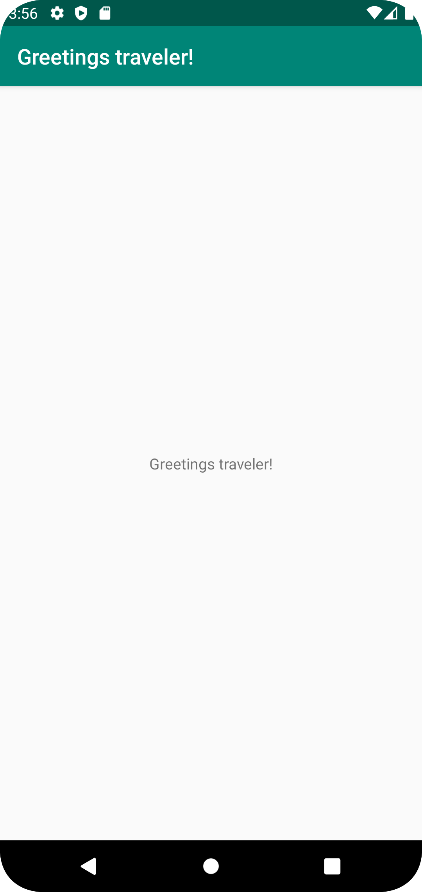

# Rapport

**Skriv din rapport här!**

För att lösa uppgift 1: "Hello World!" så gick jag forkade jag först uppgiften. Därefter så clonade jag appen till min android studios, 
där jag fick tillgång till själva programmet. Inne i programmet så navigerade jag till "strings.xml", där man kan hitta texten som läses av på
appens startsida. Här ändrade jag texten "Hello" till "Greetings traveler!" enligt uppgiftsbeskrivningen. Och till sist committade och pushade
jag den nya versionen / ändringarna för applikationen till min gitgub respository.


Programkod:

```
<resources>
    <string name="app_name">Greetings traveler!</string>
</resources>
```

Bilder:




Läs gärna:

- Boulos, M.N.K., Warren, J., Gong, J. & Yue, P. (2010) Web GIS in practice VIII: HTML5 and the canvas element for interactive online mapping. International journal of health geographics 9, 14. Shin, Y. &
- Wunsche, B.C. (2013) A smartphone-based golf simulation exercise game for supporting arthritis patients. 2013 28th International Conference of Image and Vision Computing New Zealand (IVCNZ), IEEE, pp. 459–464.
- Wohlin, C., Runeson, P., Höst, M., Ohlsson, M.C., Regnell, B., Wesslén, A. (2012) Experimentation in Software Engineering, Berlin, Heidelberg: Springer Berlin Heidelberg.
